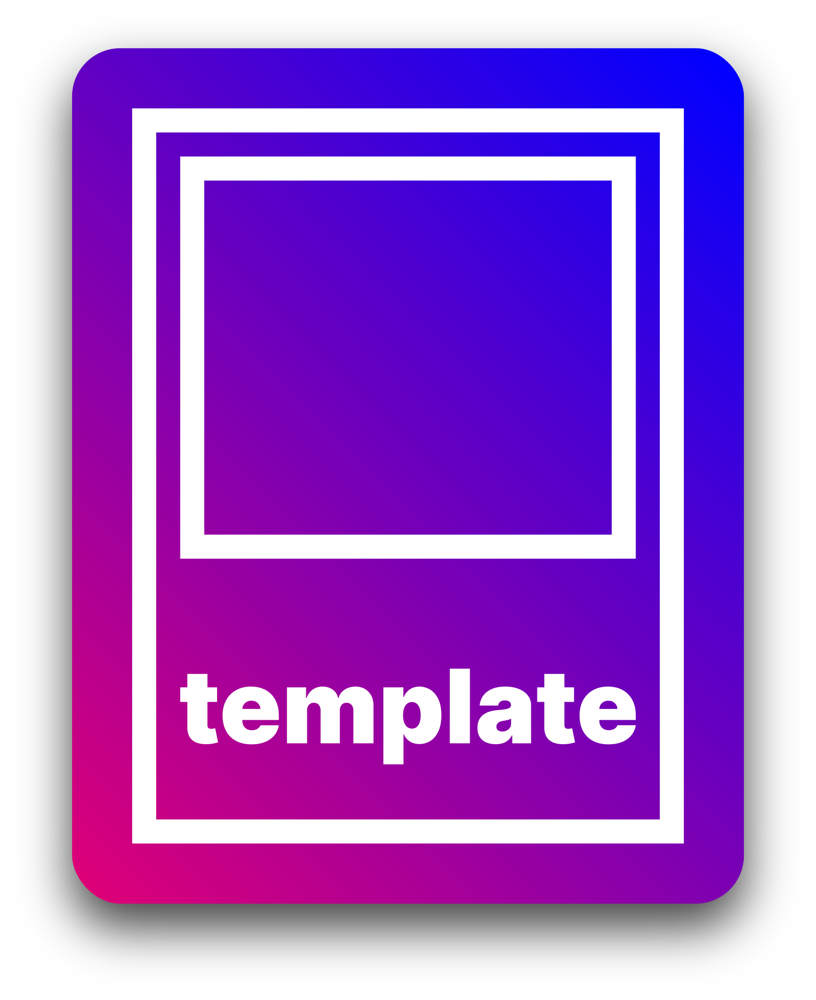

<h1 align="center">
	
</h1>

<table>
	<thead>
		<tr>
			<th colspan="5">
				<a href="">🌐</a>
			</th>
		</tr>
	</thead>
	<tbody>
		<tr>
			<td data-code="de">
				<a href="../de/readme.md">Deutsch</a>
			</td>
			<td data-code="en">
				<strong>English</strong>
			</td>
			<td rowspan="0">
				<a href="">✍️</a>
			</td>
		</tr>
	</tbody>
</table>

[![stars][2]][1]
[![contributors][4]][3]
[![forks][6]][5]
[![open-issues][8]][7]
[![closed-issues][10]][9]
[![open-prs][12]][11]
[![closed-prs][14]][13]

[![license][16]][15]
[![dependencies][18]][17]
[![dev-dependencies][20]][19]
[![peer-dependencies][22]][21]

[![downloads][24]][23]
[![version][25]][23]
[![node][27]][26]

[![reddit][29]][28]
[![twitter][31]][30]
[![discord][33]][32]

[![website][35]][34]

[1]: https://github.com/pumpncode/template/stargazers
[2]: https://badgen.net/github/stars/pumpncode/template?color=00f&labelColor=d07&icon=github
[3]: https://github.com/pumpncode/template/graphs/contributors
[4]: https://badgen.net/github/contributors/pumpncode/template?color=00f&labelColor=d07&icon=github
[5]: https://github.com/pumpncode/template/network/members
[6]: https://badgen.net/github/forks/pumpncode/template?color=00f&labelColor=d07&icon=github
[7]: https://github.com/pumpncode/template/issues?q=is%3Aopen+is%3Aissue
[8]: https://badgen.net/github/open-issues/pumpncode/template?color=00f&labelColor=d07&icon=github
[9]: https://github.com/pumpncode/template/issues?q=is%3Aclosed+is%3Aissue
[10]: https://badgen.net/github/closed-issues/pumpncode/template?color=00f&labelColor=d07&icon=github
[11]: https://github.com/pumpncode/template/pulls?q=is%3Aopen+is%3Apr
[12]: https://badgen.net/github/open-prs/pumpncode/template?color=00f&labelColor=d07&icon=github&label=open%20pull%20requests
[13]: https://github.com/pumpncode/template/pulls?q=is%3Aclosed+is%3Apr
[14]: https://badgen.net/github/closed-prs/pumpncode/template?color=00f&labelColor=d07&icon=github&label=closed%20pull%20requests
[15]: https://github.com/pumpncode/template/blob/master/license.md
[16]: https://badgen.net/github/license/pumpncode/template?color=00f&labelColor=d07&icon=github
[17]: https://david-dm.org/pumpncode/template
[18]: https://badgen.net/david/dep/pumpncode/template?color=00f&labelColor=d07&icon=npm&label=dependencies
[19]: https://david-dm.org/pumpncode/template?type=dev
[20]: https://badgen.net/david/dev/pumpncode/template?color=00f&labelColor=d07&icon=npm&label=devDependencies
[21]: https://david-dm.org/pumpncode/template?type=peer
[22]: https://badgen.net/david/peer/pumpncode/template?color=00f&labelColor=d07&icon=npm&label=peerDependencies
[23]: https://npmjs.com/package/@pumpn/template
[24]: https://badgen.net/npm/dm/@pumpn/template?color=00f&labelColor=d07&icon=npm&label=downloads
[25]: https://badgen.net/npm/v/@pumpn/template?color=00f&labelColor=d07&icon=npm&label=version
[26]: https://nodejs.org
[27]: https://badgen.net/npm/node/@pumpn/template?color=00f&labelColor=d07&icon=https%3A%2F%2Fsimpleicons.now.sh%2Fnode-dot-js%2Ffff
[28]: https://reddit.com/r/pumpnuniverse
[29]: https://badgen.net/badge/subreddit/subreddit?color=00f&labelColor=d07&icon=https%3A%2F%2Fsimpleicons.now.sh%2Freddit%2Ffff&label=
[30]: https://twitter.com/PumpnUniverse
[31]: https://badgen.net/badge/twitter/twitter?color=00f&labelColor=d07&icon=twitter&label=
[32]: https://discord.gg/WKvpetegZq
[33]: https://badgen.net/badge/discord/discord?color=00f&labelColor=d07&icon=discord&label=
[34]: https://pumpn.net/code/projects/template
[35]: https://badgen.net/badge/website/website?color=00f&labelColor=d07&icon=data%3Aimage%2Fpng%3Bbase64%2CiVBORw0KGgoAAAANSUhEUgAAABkAAAAMCAQAAAA9%2B97AAAAABGdBTUEAALGPC%2FxhBQAAACBjSFJNAAB6JgAAgIQAAPoAAACA6AAAdTAAAOpgAAA6mAAAF3CculE8AAAAAmJLR0QA%2F4ePzL8AAAAJcEhZcwAACxMAAAsTAQCanBgAAAAHdElNRQflAREIHwyVZyrWAAABCklEQVQoz3WRvUvCURSGDxQEkSEYbdFg%2F4Y2BBLU0tRYLbk4NOQa7uEQQVMEUUMELY1BkDQpSEXRBwSKQxFF0hdUBE%2FL6%2Fldk%2B5dzvue8xzOvccwv92MUWCPKg2awCVdykwyFNW1giTrfPH3JJXNA1uMhMiKSmqUaQZIynsfALDaQkoqmNZ4J45MOTIh5xgzliU%2BSCi97ciMI3Fe5RWNO4W39GD0kgsGmw8%2B51zevfGo8JsX3vlpe36InMl7Mjb4%2F8w5EONZ3qbRT01iiVEWmaXoyK6AQfbl1IkbRh%2BHAKx5z7JDD5S4dnVELFplhtNg9gFuOoasMN6%2BfcNIkw3UAld88sYFO%2BQYjjK%2F7%2FzNJHjJbowAAAAldEVYdGRhdGU6Y3JlYXRlADIwMjEtMDEtMTdUMDg6MzE6MTErMDA6MDDw92QkAAAAJXRFWHRkYXRlOm1vZGlmeQAyMDIxLTAxLTE3VDA4OjMxOjExKzAwOjAwgarcmAAAAABJRU5ErkJggg%3D%3D&label=
