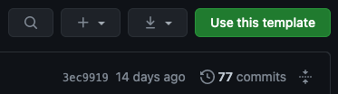
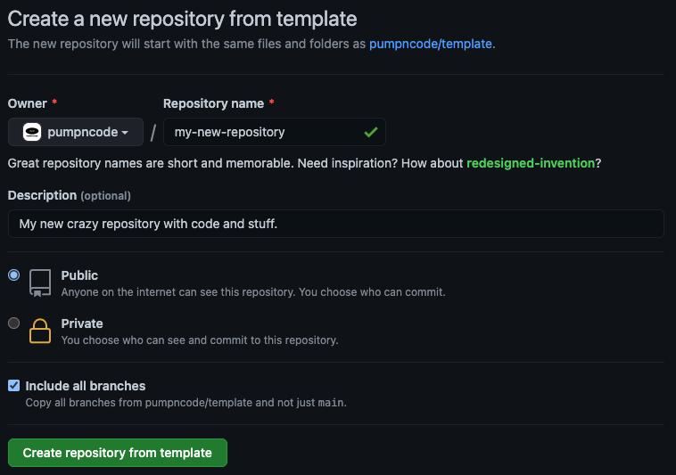

# <p align="center"></p>

[![stargazers][stars-shield]][stars-url]
[![contributors][contributors-shield]][contributors-url]
[![forks][forks-shield]][forks-url]
[![issues][issues-shield]][issues-url]
[![pull Requests][pr-shield]][pr-url]

[![languages][languageCount-shield]][languageCount-url]
[![languages][topLanguage-shield]][topLanguage-url]
[![license][license-shield]][license-url]
[![dependency status][dependencies-shield]][dependencies-url]
[![release dependency status][releaseDependencies-shield]][releaseDependencies-url]

[![downloads][downloads-shield]][downloads-url]
[![sourcerank][sourcerank-shield]][sourcerank-url]
[![version][version-shield]][version-url]
[![node][node-shield]][node-url]

[![reddit][reddit-shield]][reddit-url]
[![twitter][twitter-shield]][twitter-url]
[![discord][discord-shield]][discord-url]

<!-- [![main dependency][mainDependency-shield]][mainDependency-url] -->

[![website][website-shield]][website-url]
[![hsts][hsts-shield]][hsts-url]

The basic repository template for pumpn code projects

## Table of Contents

1. [About The Project](#about-the-project)
2. [Getting Started](#getting-started)
    1. [Prerequisites](#prerequisites)
    2. [Installation](#installation)
3. [Usage](#usage)
4. [Roadmap](#roadmap)
5. [Contributing](#contributing)
6. [License](#license)
7. [Contact](#contact)
8. [Acknowledgements](#acknowledgements)

<!-- ABOUT THE PROJECT -->
## About The Project

<p align="center">
	
</p>

This is the main template repository for all our projects and the origin of all the other templates, which is why it should only rarely be used directly. It only includes the very basic structure and a couple of important so-called dotfiles.

---

This readme uses emoji suffixes in some cases to possibly accelerate your setup process by highlighting options you may or may not want to take into consideration:

- The suffix 💎 identifies a not always mandatory but recommended option or extra-step.
- The suffix 🤡 identifies a possible but in the context of this project a usually inconvenient option that should only be considered if it's really unavoidable.
- The suffixes 🍎 (macOS), 🪟 (Windows and [WSL](https://docs.microsoft.com/en-us/windows/wsl/about)) and 🐧 (Linux) identify platform-specific information or installation steps.

<!-- GETTING STARTED -->
## Getting Started

### Prerequisites

If you're a developer, you'll probably already have those or working alternatives, so feel free to skip to the [Installation](#installation) section if you're sure you have everything to get started. Also, this guide assumes you already have [Windows](https://www.microsoft.com/windows), or a unix or unix-like operating system (like [macOS](https://www.apple.com/macos) for example) and a [modern browser](https://browsehappy.com/) installed. This project should work on every imaginable modern system configuration, but your best bet would be to use a well established and popular one.

- [GitHub Account](https://github.com/join) 💎
- [Homebrew](https://brew.sh/) 🍎

	```sh
	/bin/bash -c "$(curl -fsSL https://raw.githubusercontent.com/Homebrew/install/HEAD/install.sh)"
	```

- [Git](https://git-scm.com/)
	- [macOS](https://git-scm.com/download/mac) 🍎
		- Homebrew 💎

			```sh
			brew install git
			```
		
		- [Binary Installer](https://sourceforge.net/projects/git-osx-installer/)
		- [Through Xcode](https://developer.apple.com/xcode/) 🤡
			> Installing git through Xcode, which was a dozen gigabytes large and took an hour to setup last time I checked, is a [Pyrrhic victory](https://en.wikipedia.org/wiki/Pyrrhic_victory). If you already have Xcode, I guess it's fine to use "their" git though.
	- [Windows](https://git-scm.com/download/win) 🪟
	- [Linux](https://git-scm.com/download/linux) 🐧

- [Node.js](https://nodejs.org/)
	- Install through [nvm](https://github.com/nvm-sh/nvm) 💎
		- macOS, Linux & WSL 💎
			1. Install [nvm](https://github.com/nvm-sh/nvm)

				```sh
				curl -o- https://raw.githubusercontent.com/nvm-sh/nvm/v0.37.2/install.sh | bash
				```

			2. Install the latest Node.js

				```sh
				nvm install node
				````
		
		- Windows 🪟
			1. Install [nvm-windows](https://github.com/coreybutler/nvm-windows)
			2. Install the latest Node.js

				```sh
				nvm install latest
				```

	- [Download and install directly](https://nodejs.org/en/download/current/)

### Installation

1. Get the template
	- Create a new repository from template 💎
		1. Click "Use this template"
			

		2. Fill in the details, check "Include all branches" and click "Create repository from template"
			

	- Create a new repository by cloning 🤡
		> This totally defeats the purpose of the GitHub template feature, because it not only clones the base repository, but inherits all of the features specific to GitHub. By simply cloning, you'll lose all of that.

		1. Clone this repository into a new folder

			```sh
			git clone https://github.com/pumpncode/template.git my-new-repository
			```

		2. Go into that folder

			```sh
			cd my-new-repository
			```

2. Install NPM packages

	 ```sh
	 npm install
	 ```

<!-- USAGE EXAMPLES -->
## Usage

Use this space to show useful examples of how a project can be used. Additional screenshots, code examples and demos work well in this space. You may also link to more resources.

_For more examples, please refer to the [Documentation](https://example.com)_

<!-- ROADMAP -->
## Roadmap

See the [open issues](https://github.com/pumpncode/template/issues) for a list of proposed features (and known issues).

<!-- CONTRIBUTING -->
## Contributing

Contributions are what make the open source community such an amazing place to be learn, inspire, and create. Any contributions you make are **greatly appreciated**.

1. Fork the Project
2. Create your Feature Branch (`git checkout -b feature/AmazingFeature`)
3. Commit your Changes (`git commit -m 'Add some AmazingFeature'`)
4. Push to the Branch (`git push origin feature/AmazingFeature`)
5. Open a Pull Request

<!-- LICENSE -->
## License

Distributed under the MIT License. See `LICENSE` for more information.

<!-- CONTACT -->
## Contact

Nano Miratus - [@nnmrts](https://twitter.com/nnmrts) - nanomiratus@gmail.com

Project Link: [https://github.com/pumpncode/template](https://github.com/pumpncode/template)

<!-- ACKNOWLEDGEMENTS -->
## Acknowledgements

* []()
* []()
* []()

[product-screenshot]: ./media/images/banner.png

<!-- REFERENCES -->
[stars-shield]: https://img.shields.io/github/stars/pumpncode/template?color=white&labelColor=black&logo=github&logoColor=white&style=flat
[stars-url]: https://github.com/pumpncode/template/stargazers
[contributors-shield]: https://img.shields.io/github/contributors/pumpncode/template?color=white&labelColor=black&logo=github&logoColor=white&style=flat
[contributors-url]: https://github.com/pumpncode/template/graphs/contributors
[forks-shield]: https://img.shields.io/github/forks/pumpncode/template?color=white&labelColor=black&logo=github&logoColor=white&style=flat
[forks-url]: https://github.com/pumpncode/template/network/members
[issues-shield]: https://img.shields.io/github/issues-raw/pumpncode/template?color=white&labelColor=black&logo=github&logoColor=white&style=flat
[issues-url]: https://github.com/pumpncode/template/issues
[pr-shield]: https://img.shields.io/github/issues-pr-raw/pumpncode/template?color=white&labelColor=black&logo=github&logoColor=white&style=flat
[pr-url]: https://github.com/pumpncode/template/pulls
[topLanguage-shield]: https://img.shields.io/github/languages/top/pumpncode/template?color=white&labelColor=black&logo=github&logoColor=white&style=flat
[topLanguage-url]: https://github.com/pumpncode/template
[languageCount-shield]: https://img.shields.io/github/languages/count/pumpncode/template?color=white&labelColor=black&logo=github&logoColor=white&style=flat
[languageCount-url]: https://github.com/pumpncode/template
[license-shield]: https://img.shields.io/github/license/pumpncode/template?color=white&labelColor=black&logo=github&logoColor=white&style=flat
[license-url]: https://github.com/pumpncode/template/blob/master/license.md
[dependencies-shield]: https://img.shields.io/librariesio/github/pumpncode/template?color=white&labelColor=black&logo=github&logoColor=white&style=flat
[dependencies-url]: https://libraries.io/github/pumpncode/template
[releaseDependencies-shield]: https://img.shields.io/librariesio/release/npm/@pumpn/template?color=white&label=release%20dependencies&labelColor=black&logo=data%3Aimage%2Fsvg%2Bxml%3Bbase64%2CPHN2ZyByb2xlPSJpbWciIHZpZXdCb3g9IjAgMCAyNCAyNCIgeG1sbnM9Imh0dHA6Ly93d3cudzMub3JnLzIwMDAvc3ZnIj48dGl0bGU%2BTlBNIGljb248L3RpdGxlPjxwYXRoIGZpbGw9IndoaXRlIiBkPSJNMCA3LjMzNHY4aDYuNjY2djEuMzMySDEydi0xLjMzMmgxMnYtOEgwem02LjY2NiA2LjY2NEg1LjMzNHYtNEgzLjk5OXY0SDEuMzM1VjguNjY3aDUuMzMxdjUuMzMxem00IDB2MS4zMzZIOC4wMDFWOC42NjdoNS4zMzR2NS4zMzJoLTIuNjY5di0uMDAxem0xMi4wMDEgMGgtMS4zM3YtNGgtMS4zMzZ2NGgtMS4zMzV2LTRoLTEuMzN2NGgtMi42NzFWOC42NjdoOC4wMDJ2NS4zMzF6TTEwLjY2NSAxMEgxMnYyLjY2N2gtMS4zMzVWMTB6Ii8%2BPC9zdmc%2B&logoColor=white&style=flat
[releaseDependencies-url]: https://libraries.io/npm/%40pumpn%2Ftemplate
[downloads-shield]: https://img.shields.io/npm/dm/@pumpn/template?color=white&label=downloads&labelColor=black&logo=data%3Aimage%2Fsvg%2Bxml%3Bbase64%2CPHN2ZyByb2xlPSJpbWciIHZpZXdCb3g9IjAgMCAyNCAyNCIgeG1sbnM9Imh0dHA6Ly93d3cudzMub3JnLzIwMDAvc3ZnIj48dGl0bGU%2BTlBNIGljb248L3RpdGxlPjxwYXRoIGZpbGw9IndoaXRlIiBkPSJNMCA3LjMzNHY4aDYuNjY2djEuMzMySDEydi0xLjMzMmgxMnYtOEgwem02LjY2NiA2LjY2NEg1LjMzNHYtNEgzLjk5OXY0SDEuMzM1VjguNjY3aDUuMzMxdjUuMzMxem00IDB2MS4zMzZIOC4wMDFWOC42NjdoNS4zMzR2NS4zMzJoLTIuNjY5di0uMDAxem0xMi4wMDEgMGgtMS4zM3YtNGgtMS4zMzZ2NGgtMS4zMzV2LTRoLTEuMzN2NGgtMi42NzFWOC42NjdoOC4wMDJ2NS4zMzF6TTEwLjY2NSAxMEgxMnYyLjY2N2gtMS4zMzVWMTB6Ii8%2BPC9zdmc%2B&logoColor=white&style=flat
[downloads-url]: https://npmjs.com/package/@pumpn/template
[sourcerank-shield]: https://img.shields.io/librariesio/sourcerank/npm/@pumpn/template?color=white&labelColor=black&logo=data%3Aimage%2Fsvg%2Bxml%3Bbase64%2CPHN2ZyByb2xlPSJpbWciIHZpZXdCb3g9IjAgMCAyNCAyNCIgeG1sbnM9Imh0dHA6Ly93d3cudzMub3JnLzIwMDAvc3ZnIj48dGl0bGU%2BTlBNIGljb248L3RpdGxlPjxwYXRoIGZpbGw9IndoaXRlIiBkPSJNMCA3LjMzNHY4aDYuNjY2djEuMzMySDEydi0xLjMzMmgxMnYtOEgwem02LjY2NiA2LjY2NEg1LjMzNHYtNEgzLjk5OXY0SDEuMzM1VjguNjY3aDUuMzMxdjUuMzMxem00IDB2MS4zMzZIOC4wMDFWOC42NjdoNS4zMzR2NS4zMzJoLTIuNjY5di0uMDAxem0xMi4wMDEgMGgtMS4zM3YtNGgtMS4zMzZ2NGgtMS4zMzV2LTRoLTEuMzN2NGgtMi42NzFWOC42NjdoOC4wMDJ2NS4zMzF6TTEwLjY2NSAxMEgxMnYyLjY2N2gtMS4zMzVWMTB6Ii8%2BPC9zdmc%2B&logoColor=white&style=flat
[sourcerank-url]: https://libraries.io/npm/%40pumpn%2Ftemplate/sourcerank
[version-shield]: https://img.shields.io/npm/v/@pumpn/template?color=white&label=version&labelColor=black&logo=data%3Aimage%2Fsvg%2Bxml%3Bbase64%2CPHN2ZyByb2xlPSJpbWciIHZpZXdCb3g9IjAgMCAyNCAyNCIgeG1sbnM9Imh0dHA6Ly93d3cudzMub3JnLzIwMDAvc3ZnIj48dGl0bGU%2BTlBNIGljb248L3RpdGxlPjxwYXRoIGZpbGw9IndoaXRlIiBkPSJNMCA3LjMzNHY4aDYuNjY2djEuMzMySDEydi0xLjMzMmgxMnYtOEgwem02LjY2NiA2LjY2NEg1LjMzNHYtNEgzLjk5OXY0SDEuMzM1VjguNjY3aDUuMzMxdjUuMzMxem00IDB2MS4zMzZIOC4wMDFWOC42NjdoNS4zMzR2NS4zMzJoLTIuNjY5di0uMDAxem0xMi4wMDEgMGgtMS4zM3YtNGgtMS4zMzZ2NGgtMS4zMzV2LTRoLTEuMzN2NGgtMi42NzFWOC42NjdoOC4wMDJ2NS4zMzF6TTEwLjY2NSAxMEgxMnYyLjY2N2gtMS4zMzVWMTB6Ii8%2BPC9zdmc%2B&logoColor=white&style=flat
[version-url]: https://npmjs.com/package/@pumpn/template
[node-shield]: https://img.shields.io/node/v/@pumpn/template?color=white&labelColor=black&logo=node.js&logoColor=white&style=flat
[node-url]: https://nodejs.org
[reddit-shield]: https://img.shields.io/reddit/subreddit-subscribers/pumpnuniverse?color=white&label=r/pumpnuniverse&labelColor=black&logo=reddit&logoColor=white&style=flat
[reddit-url]: https://reddit.com/r/pumpnuniverse
[twitter-shield]: https://img.shields.io/twitter/follow/PumpnUniverse?color=white&label=twitter&labelColor=black&logo=twitter&logoColor=white&style=flat
[twitter-url]: https://twitter.com/PumpnUniverse
[discord-shield]: https://img.shields.io/discord/781324491182571530?color=white&label=discord&labelColor=black&logo=discord&logoColor=white&style=flat
[discord-url]: https://discord.gg/WKvpetegZq
[mainDependency-shield]: https://img.shields.io/npm/dependency-version/@pumpn/template/peer/eslint?color=white&labelColor=black&logo=eslint&logoColor=white&style=flat
[mainDependency-url]: https://npmjs.com/package/eslint
[website-shield]: https://img.shields.io/website?url=https://pumpn.net/code/projects/template&color=white&labelColor=black&logo=data%3Aimage%2Fpng%3Bbase64%2CiVBORw0KGgoAAAANSUhEUgAAABkAAAAMCAYAAACX8hZLAAAACXBIWXMAAAsTAAALEwEAmpwYAAAHLmlUWHRYTUw6Y29tLmFkb2JlLnhtcAAAAAAAPD94cGFja2V0IGJlZ2luPSLvu78iIGlkPSJXNU0wTXBDZWhpSHpyZVN6TlRjemtjOWQiPz4gPHg6eG1wbWV0YSB4bWxuczp4PSJhZG9iZTpuczptZXRhLyIgeDp4bXB0az0iQWRvYmUgWE1QIENvcmUgNi4wLWMwMDIgNzkuMTY0NDYwLCAyMDIwLzA1LzEyLTE2OjA0OjE3ICAgICAgICAiPiA8cmRmOlJERiB4bWxuczpyZGY9Imh0dHA6Ly93d3cudzMub3JnLzE5OTkvMDIvMjItcmRmLXN5bnRheC1ucyMiPiA8cmRmOkRlc2NyaXB0aW9uIHJkZjphYm91dD0iIiB4bWxuczp4bXA9Imh0dHA6Ly9ucy5hZG9iZS5jb20veGFwLzEuMC8iIHhtbG5zOmRjPSJodHRwOi8vcHVybC5vcmcvZGMvZWxlbWVudHMvMS4xLyIgeG1sbnM6cGhvdG9zaG9wPSJodHRwOi8vbnMuYWRvYmUuY29tL3Bob3Rvc2hvcC8xLjAvIiB4bWxuczp4bXBNTT0iaHR0cDovL25zLmFkb2JlLmNvbS94YXAvMS4wL21tLyIgeG1sbnM6c3RFdnQ9Imh0dHA6Ly9ucy5hZG9iZS5jb20veGFwLzEuMC9zVHlwZS9SZXNvdXJjZUV2ZW50IyIgeG1wOkNyZWF0b3JUb29sPSJBZG9iZSBQaG90b3Nob3AgMjEuMCAoTWFjaW50b3NoKSIgeG1wOkNyZWF0ZURhdGU9IjIwMTktMDktMTJUMDE6MTY6NTMrMDI6MDAiIHhtcDpNb2RpZnlEYXRlPSIyMDIwLTEyLTAzVDE5OjM1OjE1KzAxOjAwIiB4bXA6TWV0YWRhdGFEYXRlPSIyMDIwLTEyLTAzVDE5OjM1OjE1KzAxOjAwIiBkYzpmb3JtYXQ9ImltYWdlL3BuZyIgcGhvdG9zaG9wOkNvbG9yTW9kZT0iMyIgcGhvdG9zaG9wOklDQ1Byb2ZpbGU9InNSR0IgSUVDNjE5NjYtMi4xIiB4bXBNTTpJbnN0YW5jZUlEPSJ4bXAuaWlkOjJhNTJmYjA5LWIxYTQtNGY3OC1hZWQxLWJkMTM0YmQ3YWRjNiIgeG1wTU06RG9jdW1lbnRJRD0iYWRvYmU6ZG9jaWQ6cGhvdG9zaG9wOjJjZTY2ZDg2LWUxZWYtZjA0ZC1iODcyLTFmNzAxMzA0YjRhMCIgeG1wTU06T3JpZ2luYWxEb2N1bWVudElEPSJ4bXAuZGlkOjBhMDM5OTQ5LTY2OTctNDkxOC04NjRiLTA2YzA4MzQ1NmI5MiI%2BIDx4bXBNTTpIaXN0b3J5PiA8cmRmOlNlcT4gPHJkZjpsaSBzdEV2dDphY3Rpb249ImNyZWF0ZWQiIHN0RXZ0Omluc3RhbmNlSUQ9InhtcC5paWQ6MGEwMzk5NDktNjY5Ny00OTE4LTg2NGItMDZjMDgzNDU2YjkyIiBzdEV2dDp3aGVuPSIyMDE5LTA5LTEyVDAxOjE2OjUzKzAyOjAwIiBzdEV2dDpzb2Z0d2FyZUFnZW50PSJBZG9iZSBQaG90b3Nob3AgMjEuMCAoTWFjaW50b3NoKSIvPiA8cmRmOmxpIHN0RXZ0OmFjdGlvbj0iY29udmVydGVkIiBzdEV2dDpwYXJhbWV0ZXJzPSJmcm9tIGFwcGxpY2F0aW9uL3ZuZC5hZG9iZS5waG90b3Nob3AgdG8gaW1hZ2UvcG5nIi8%2BIDxyZGY6bGkgc3RFdnQ6YWN0aW9uPSJzYXZlZCIgc3RFdnQ6aW5zdGFuY2VJRD0ieG1wLmlpZDpkZmFjYjQ0OS0zYzQwLTRkY2YtYWQ1OS1lN2E4ZThkMWE0OTUiIHN0RXZ0OndoZW49IjIwMjAtMDctMDRUMDg6MjM6MTErMDI6MDAiIHN0RXZ0OnNvZnR3YXJlQWdlbnQ9IkFkb2JlIFBob3Rvc2hvcCAyMS4wIChNYWNpbnRvc2gpIiBzdEV2dDpjaGFuZ2VkPSIvIi8%2BIDxyZGY6bGkgc3RFdnQ6YWN0aW9uPSJzYXZlZCIgc3RFdnQ6aW5zdGFuY2VJRD0ieG1wLmlpZDoyYTUyZmIwOS1iMWE0LTRmNzgtYWVkMS1iZDEzNGJkN2FkYzYiIHN0RXZ0OndoZW49IjIwMjAtMTItMDNUMTk6MzU6MTUrMDE6MDAiIHN0RXZ0OnNvZnR3YXJlQWdlbnQ9IkFkb2JlIFBob3Rvc2hvcCAyMS4yIChNYWNpbnRvc2gpIiBzdEV2dDpjaGFuZ2VkPSIvIi8%2BIDwvcmRmOlNlcT4gPC94bXBNTTpIaXN0b3J5PiA8L3JkZjpEZXNjcmlwdGlvbj4gPC9yZGY6UkRGPiA8L3g6eG1wbWV0YT4gPD94cGFja2V0IGVuZD0iciI%2FPmkKpRsAAAFWSURBVDiNlZO%2FS1thFIaftgmKNiGgdvMHpGv%2FhJitFHRxcrSTLg4d2tV%2FQDJIwalbO4ij4iIILZ100WIhCoUWhIougiK0FPs45AY%2BTr8QeuBy%2Bd7zvueB7577QCVTJaAJNIBnwBQwBlSAGtAu9LskMwt8Ac7%2BmaamT119p%2F62f9VD9k2hv1efpr3UtBaGfFf31asekEaAoO4m%2FbcR8ikMmE%2BCJfUwA5nLQGaC53MXshoat%2BpICH%2FIQBYykJp6HXwt1J9B%2FKYOFKEhdTkDUF3MQFCPg%2B%2B8BJTDLkwAl8AjYLB4%2F0%2F9DefyQ2A7ikAVGO4D%2BJPRKsB40HZQq3Y2Ka0Vtam%2BVl%2Bqrcx1bYZreqJuBc8PtdY1PFb3kuZ65q73M6ALO5t5kul9VCuG%2FwT1uXpUmOKHHVVPM8NiHagv0mxuO1Cn1aUevVdqW%2F2l3qhf1Q07WziZy9wD18gj4JwLO8sAAAAASUVORK5CYII%3D&logoColor=white&style=flat
[website-url]: https://pumpn.net/code/projects/template
[hsts-shield]: https://img.shields.io/hsts/preload/pumpn.net?color=white&labelColor=black&logo=chrome&logoColor=white&style=flat
[hsts-url]: https://hstspreload.org/?domain=pumpn.net
