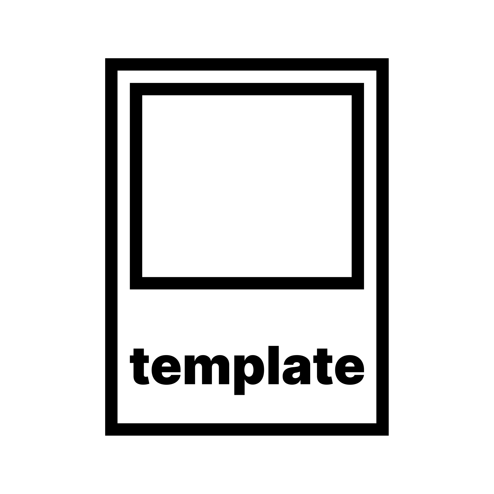

<!-- logo -->
<h1 align="center">
	
</h1>

<!-- t9n -->
<table>
	<thead>
		<tr>
			<th align="center" colspan="5">
				<a href="">🌐</a>
			</th>
		</tr>
	</thead>
	<tbody align="center">
		<tr>
			<td data-code="cmn-Hans">
				<a href="./docs/cmn-hans/readme.md">简体中文</a>
			</td>
			<td data-code="cmn-Hant">
				<a href="./docs/cmn-hant/readme.md">繁體中文</a>
			</td>
			<td data-code="de">
				<a href="./docs/de/readme.md">Deutsch</a>
			</td>
			<td data-code="en">
				<strong>English</strong>
			</td>
			<td rowspan="0">
				<a href="">✍️</a>
			</td>
		</tr>
		<tr>
			<td data-code="es">
				<a href="./docs/es/readme.md">Español</a>
			</td>
			<td data-code="fr">
				<a href="./docs/fr/readme.md">Français</a>
			</td>
			<td data-code="ja">
				<a href="./docs/ja/readme.md">日本語</a>
			</td>
			<td data-code="ru">
				<a href="./docs/ru/readme.md">Русский</a>
			</td>
		</tr>
	</tbody>
</table>

<!-- badges -->
[![stars][stars-badge]][stars-url]
[![contributors][contributors-badge]][contributors-url]
[![forks][forks-badge]][forks-url]
[![open-issues][open-issues-badge]][open-issues-url]
[![closed-issues][closed-issues-badge]][closed-issues-url]
[![open-prs][open-prs-badge]][open-prs-url]
[![closed-prs][closed-prs-badge]][closed-prs-url]

[![license][license-badge]][license-url]
[![dependencies][dependencies-badge]][dependencies-url]
[![dev-dependencies][dev-dependencies-badge]][dev-dependencies-url]
[![peer-dependencies][peer-dependencies-badge]][peer-dependencies-url]

[![downloads][downloads-badge]][downloads-url]
[![version][version-badge]][version-url]
[![node][node-badge]][node-url]

[![reddit][reddit-badge]][reddit-url]
[![twitter][twitter-badge]][twitter-url]
[![discord][discord-badge]][discord-url]

[![mainDependency][mainDependency-badge]][mainDependency-url]

[![website][website-badge]][website-url]

<!-- about -->
## About The Project

This is the main template repository for all our projects and the origin of all the other templates, which is why it should only rarely be used directly for end products. It only includes the very basic structure and a couple of important so-called dotfiles.

*At the moment it also includes more specific files like a rollup config and react examples files, those should be removed once we reach 2.0.0 and have a seperate template project for that.*

---

"Unordered" lists in this readme are still ordered by priority and should be read from top to bottom, they just aren't markdown ordered lists becuase they don't signify a fixed sequence of steps.

This readme uses emoji suffixes in some cases to possibly accelerate your setup process by highlighting options you may or may not want to take into consideration:

- The suffix 💎 identifies a not always mandatory but **recommended** option or extra-step.
- The suffix 🤡 identifies a possible but in the context of this project usually **inconvenient** option that should only be considered if it's really unavoidable.
- The suffixes 🍎 (macOS), 🪟 (Windows and [WSL](https://docs.microsoft.com/en-us/windows/wsl/about)) and 🐧 (Linux) identify **platform-specific** information or installation steps.

<!-- start -->
## Getting Started

### Prerequisites

If you're a developer, you'll probably already have those or working alternatives, so feel free to skip to the [Installation section](#installation). Also, this guide assumes you already have [Windows](https://www.microsoft.com/windows), or a unix or unix-like operating system (like [macOS](https://www.apple.com/macos) for example) and a [modern browser](https://browsehappy.com/) installed. This project should work on every imaginable modern system configuration, but your best bet would be to use a well established and popular one.

- [GitHub Account](https://github.com/join) 💎
- [Homebrew](https://brew.sh/) 🍎

	```sh
	/bin/bash -c "$(curl -fsSL https://raw.githubusercontent.com/Homebrew/install/HEAD/install.sh)"
	```

- [Git](https://git-scm.com/)
	- [macOS](https://git-scm.com/download/mac) 🍎
		- Homebrew 💎

			```sh
			brew install git
			```
		
		- [Binary Installer](https://sourceforge.net/projects/git-osx-installer/)
		- [Through Xcode](https://developer.apple.com/xcode/) 🤡
			> Installing git through Xcode, which was a dozen gigabytes large and took an hour to setup last time I checked, is a [Pyrrhic victory](https://en.wikipedia.org/wiki/Pyrrhic_victory). If you already have Xcode, I guess it's fine to use "their" git though.
	- [Windows](https://git-scm.com/download/win) 🪟
	- [Linux](https://git-scm.com/download/linux) 🐧

- [Node.js](https://nodejs.org/)
	- Install through [nvm](https://github.com/nvm-sh/nvm) 💎
		- macOS, Linux & WSL 💎
			1. Install [nvm](https://github.com/nvm-sh/nvm)

				```sh
				curl -o- https://raw.githubusercontent.com/nvm-sh/nvm/v0.37.2/install.sh | bash
				```

			2. Install the latest Node.js

				```sh
				nvm install node
				````
		
		- Windows 🪟
			1. Install [nvm-windows](https://github.com/coreybutler/nvm-windows)
			2. Install the latest Node.js

				```sh
				nvm install latest
				```

	- [Download and install directly](https://nodejs.org/en/download/current/)
- [A source-code editor](https://en.wikipedia.org/wiki/Source-code_editor#Notable_examples)

### Installation

1. Get the template
	- Create a new repository from template 💎
		1. Click "Use this template"
			

		2. Fill in the details, check "Include all branches" and click "Create repository from template"
			
		
		3. Clone your new repository

			```sh
			git clone https://github.com/username/my-new-repository.git
			```

	- Create a new repository by cloning 🤡
		> This completely defeats the purpose of the GitHub template feature, because normal clones (and forks) copy the whole commit history (and other things) but not all branches, which normally isn't what you want when creating a new project based on a boilerplate. Read more [here](https://docs.github.com/en/free-pro-team@latest/github/creating-cloning-and-archiving-repositories/creating-a-repository-from-a-template#about-repository-templates).

		1. Clone this repository into a new folder

			```sh
			git clone https://github.com/pumpncode/template.git my-new-repository
			```

2. Set it up
	1. Go into your new repository folder

		```sh
		cd my-new-repository
		```

	2. Install the dependencies

		```sh
		npm install
		```

3. Personalize your new repository
	1. Personalize [package.json](./package.json)
		1. Replace package name `@pumpn/template`
		2. Replace GitHub repository name `pumpncode/template`
		3. Replace bugs email `office@pumpn.net`
		4. Replace keys `author`, `funding`, `repository`
		5. Add new contributors to key `contributors`
	2. Personalize the readme
		1. Open [badges.js](./badges.js) and follow the steps
		2. Open [readme.md](./readme.md) and replace everything you need to
	3. Personalize the [manual](./man/doc.1) or delete it if your project doesn't have a CLI
	4. Review all .md files and replace personalized text if needed

<!-- usage -->
## Usage

Because this is a template, the usage depends on what your new project should do. Once everything is installed, you can try out running the scripts in the [package.json](./package.json), because these make use of pretty much every other feature of this template.

<!-- roadmap -->
## Roadmap

See the [current projects](https://github.com/pumpncode/template/projects) and the [open issues](https://github.com/pumpncode/template/issues) for a list of proposed features (and known issues).

<!-- contributing -->
## Contributing

Contributions are what make the open source community such an amazing place to learn, inspire, and create. Any contributions you make are **greatly appreciated**.

Please read the [code of conduct](./code_of_conduct.md) and the [contributing guidelines](./contributing.md) before opening an issue or pull request.

<!-- license -->
## License

Distributed under the MIT License. See [license.md](./license.md) for more information.

<!-- contact -->
## Contact

Pumpn Code - office@pumpn.net

Nano Miratus - [@nnmrts](https://twitter.com/nnmrts) - nanomiratus@gmail.com

Project Link: [https://github.com/pumpncode/template](https://github.com/pumpncode/template)

<!-- acknowledgements -->
## Acknowledgements

- [Best-README-Template](https://github.com/othneildrew/Best-README-Template)
- []()
- []()

<!-- references -->
[stars-badge]: https://badgen.net/github/stars/pumpncode/template?color=00f&icon=github&labelColor=d07
[stars-url]: https://github.com/pumpncode/template/stargazers
[contributors-badge]: https://badgen.net/github/contributors/pumpncode/template?color=00f&icon=github&labelColor=d07
[contributors-url]: https://github.com/pumpncode/template/graphs/contributors
[forks-badge]: https://badgen.net/github/forks/pumpncode/template?color=00f&icon=github&labelColor=d07
[forks-url]: https://github.com/pumpncode/template/network/members
[open-issues-badge]: https://badgen.net/github/open-issues/pumpncode/template?color=00f&icon=github&labelColor=d07
[open-issues-url]: https://github.com/pumpncode/template/issues?q=is%3Aopen+is%3Aissue
[closed-issues-badge]: https://badgen.net/github/closed-issues/pumpncode/template?color=00f&icon=github&labelColor=d07
[closed-issues-url]: https://github.com/pumpncode/template/issues?q=is%3Aclosed+is%3Aissue
[open-prs-badge]: https://badgen.net/github/open-prs/pumpncode/template?color=00f&icon=github&label=open%20pull%20requests&labelColor=d07
[open-prs-url]: https://github.com/pumpncode/template/pulls?q=is%3Aopen+is%3Apr
[closed-prs-badge]: https://badgen.net/github/closed-prs/pumpncode/template?color=00f&icon=github&label=closed%20pull%20requests&labelColor=d07
[closed-prs-url]: https://github.com/pumpncode/template/pulls?q=is%3Aclosed+is%3Apr
[license-badge]: https://badgen.net/github/license/pumpncode/template?color=00f&icon=github&labelColor=d07
[license-url]: https://github.com/pumpncode/template/blob/master/license.md
[dependencies-badge]: https://badgen.net/david/dep/pumpncode/template?color=00f&icon=npm&label=dependencies&labelColor=d07
[dependencies-url]: https://david-dm.org/pumpncode/template
[dev-dependencies-badge]: https://badgen.net/david/dev/pumpncode/template?color=00f&icon=npm&label=devDependencies&labelColor=d07
[dev-dependencies-url]: https://david-dm.org/pumpncode/template?type=dev
[peer-dependencies-badge]: https://badgen.net/david/peer/pumpncode/template?color=00f&icon=npm&label=peerDependencies&labelColor=d07
[peer-dependencies-url]: https://david-dm.org/pumpncode/template?type=peer
[downloads-badge]: https://badgen.net/npm/dm/@pumpn/template?color=00f&icon=npm&label=downloads&labelColor=d07
[downloads-url]: https://npmjs.com/package/@pumpn/template
[version-badge]: https://badgen.net/npm/v/@pumpn/template?color=00f&icon=npm&label=version&labelColor=d07
[version-url]: https://npmjs.com/package/@pumpn/template
[node-badge]: https://badgen.net/npm/node/@pumpn/template?color=00f&icon=https%3A%2F%2Fsimpleicons.now.sh%2Fnode-dot-js%2Ffff&labelColor=d07
[node-url]: https://nodejs.org
[reddit-badge]: https://badgen.net/badge/subreddit/subreddit?color=00f&icon=https%3A%2F%2Fsimpleicons.now.sh%2Freddit%2Ffff&label=&labelColor=d07
[reddit-url]: https://reddit.com/r/pumpnuniverse
[twitter-badge]: https://badgen.net/badge/twitter/twitter?color=00f&icon=twitter&label=&labelColor=d07
[twitter-url]: https://twitter.com/PumpnUniverse
[discord-badge]: https://badgen.net/badge/discord/discord?color=00f&icon=discord&label=&labelColor=d07
[discord-url]: https://discord.gg/WKvpetegZq
[mainDependency-badge]: https://badgen.net/npm/v/eslint?color=00f&icon=https%3A%2F%2Fsimpleicons.now.sh%2Feslint%2Ffff&label=eslint&labelColor=d07
[mainDependency-url]: https://npmjs.com/package/eslint
[website-badge]: https://badgen.net/badge/website/website?color=00f&icon=data%3Aimage%2Fpng%3Bbase64%2CiVBORw0KGgoAAAANSUhEUgAAABkAAAAMCAQAAAA9%2B97AAAAABGdBTUEAALGPC%2FxhBQAAACBjSFJNAAB6JgAAgIQAAPoAAACA6AAAdTAAAOpgAAA6mAAAF3CculE8AAAAAmJLR0QA%2F4ePzL8AAAAJcEhZcwAACxMAAAsTAQCanBgAAAAHdElNRQflAREIHwyVZyrWAAABCklEQVQoz3WRvUvCURSGDxQEkSEYbdFg%2F4Y2BBLU0tRYLbk4NOQa7uEQQVMEUUMELY1BkDQpSEXRBwSKQxFF0hdUBE%2FL6%2Fldk%2B5dzvue8xzOvccwv92MUWCPKg2awCVdykwyFNW1giTrfPH3JJXNA1uMhMiKSmqUaQZIynsfALDaQkoqmNZ4J45MOTIh5xgzliU%2BSCi97ciMI3Fe5RWNO4W39GD0kgsGmw8%2B51zevfGo8JsX3vlpe36InMl7Mjb4%2F8w5EONZ3qbRT01iiVEWmaXoyK6AQfbl1IkbRh%2BHAKx5z7JDD5S4dnVELFplhtNg9gFuOoasMN6%2BfcNIkw3UAld88sYFO%2BQYjjK%2F7%2FzNJHjJbowAAAAldEVYdGRhdGU6Y3JlYXRlADIwMjEtMDEtMTdUMDg6MzE6MTErMDA6MDDw92QkAAAAJXRFWHRkYXRlOm1vZGlmeQAyMDIxLTAxLTE3VDA4OjMxOjExKzAwOjAwgarcmAAAAABJRU5ErkJggg%3D%3D&label=&labelColor=d07
[website-url]: https://pumpn.net/code/projects/template
